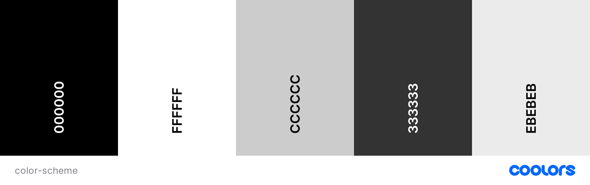

# Pianist Portfolio

This is a portfolio website for my own piano career. It aims to display the my talents and reach out to potential clients either as students or for weddings, hotel lounge work and or business functions. I aslo display some clips of me playing in regards to albums I am currently working on and hope to record and release within the coming year. The aim is to advertise my skillsets and give the viewer a means to contact me if they like what they see and would require my services.

Visit the deployed website [here](https://itjosephk2.github.io/project-1/).

## Table of Contents

1. [User Experience (UX)](#user-experience-ux)
    1. [Project Goals](#project-goals)
    2. [User Stories](#user-stories)
    3. [Color Scheme](#color-scheme)
    4. [Typography](#typography)
    5. [Wireframes](#wireframes)
2. [Features](#features)
    1. [General](#general)
    2. [Landing Page](#landing-page)
    3. [Treatments Page](#treatments-page)
    4. [Book Now Page](#book-now-page)
    5. [404 Error Page](#404-error-page)
 3. [Technologies Used](#technologies-used)
    1. [Languages Used](#languages-used)
    2. [Frameworks, Libraries and Programs Used](#frameworks-libraries-and-programs-used)
4. [Testing](#testing)
    1. [Testing User Stories](#testing-user-stories)
    2. [Code Validation](#code-validation)
    3. [Accessibility](#accessibility)
    4. [Tools Testing](#tools-testing)
    5. [Manual Testing](#manual-testing)
5. [Finished Product](#finished-product)
6. [Deployment](#deployment)
    1. [GitHub Pages](#github-pages)
7. [Credits](#credits)
    1. [Content](#content)
    2. [Media](#media)
    3. [Code](#code)
8. [Acknowledgements](#acknowledgements)

***

## User Experience (UX)

### Project Goals

* The website should be straight forward and easy to navigate.

* Showcase my talents and skillsets in my portfolio.

* Provide the customer with useful information that gives them a good idea of the services I provide.

* Provide customers with the ability tp get in touch with me.

### User Stories

* As a customer, I want to be able to navigate the website intuitively and learn more about the services being offered.

* As a customer, I want to be able to hear examples of the persons playing.

* As a customer, I want to learn more about their teaching style and credibility.

* As a customer, I want to learn more bout their playing services that they provide.

* As a customer, I want to easily find the contact information for them.

* As a customer, I want to find social media links.

* As a customer, I want to be able to contact them easily in order to inquire about their services.

### Color Scheme

The colours used in the site are Black, White primarily (#000 and #fff), Varying shades of gray or used either directly or to create a blend between white and black. common examples are (#CCC and #333) There is a use of (#EBEBEB) for the button hover effect. These colours are chosen to represent the black and white ivory keys of a piano and also to keep in touch with a minimalist modern design.

### Typography

The main font used in the site is Roboto, with Arial then Sans Serif as the fallback fonts in Roboto is not being imported correctly. 

### Wireframes

Wire frames were drawn by hand to form a rough structural shape of the site and then each section was designed with pen and paper and mocked up with htl and css befor implementation.

[Back to top ⇧](#pianist-portfolio)

## Features

### General

* Responsive design across all device sizes.

* Similar color scheme and design throughout the website to maintain consistency for the user, categorise and present the information to the customers whilst maintaing a flow of the site on both mobile and desktop.

### Landing Page

* **Header**

    - The hero sets the mood for the page and gives a the user an exact idea of what the portfolio is for.

    - The logo acts as a link to the top of the page.

    - The legacy navigation is fixed to the top of the page to enable easy scrolling on desktop. I opted for no navigation as its a scroll focused site. However there is a to the top arrow to get home when on mobile.

* **Discography**

    - Conatins an image of future albums, list of pieces that will be in them and a sample of the music.

* **Teaching**

    - Contains a text with useful geographical information as well as contact details such as the business' physical address, email and phone number.
 
* **Lounge Piano**

    - Contains a text with useful geographical information as well as contact details such as the business' physical address, email and phone number.

* **Footer**

    - The footer includes links to social media, future albums on spotify, reccomended resources for learning classical piano improvisation and venues I have performed at. There is also a bottom bar with the repeat of the logo and a copyight text to help end the page.

### 404 Error Page

*  This single page is being shown in case the customer enters an incorrect address into the address bar. It contains a link to the landing page.

[Back to top ⇧](#pianist-portfolio)

## Technologies Used

### Languages Used
* [HTML5](https://en.wikipedia.org/wiki/HTML5)
* [CSS3](https://en.wikipedia.org/wiki/CSS)

### Frameworks, Libraries and Programs Used

* [Google Fonts](https://fonts.google.com/)
    - Google Fonts was used to import the fonts Roboto into the style.css file.

* [Font Awesome](https://fontawesome.com/)
     - Font Awesome was used throughout all pages to add icons in order to create a better visual experience for UX purposes.

* [GitHub](https://github.com/)
     - GitHub was used to store the project after pushing.

* [Am I Responsive?](http://ami.responsivedesign.is/#)
    - Am I Responsive was used in order to create the mockup image.

* [Firefox Dev edition](https://www.mozilla.org/en-US/firefox/developer/)
    - Firefox dev tools was used for everything. Checking the website as I developed it. Learning the exact implications of css properties and how it effected the layout and design of an element. Checking for responsivity throughout the design to ensure it worked on all sized devices.

* [W3C Markup Validator](https://validator.w3.org/)
    - W3C Markup Validator was used to validate the HTML code.

* [W3C CSS Validator](https://jigsaw.w3.org/css-validator/)
    - W3C CSS Validator was used to validate the CSS code.

[Back to top ⇧](#pianist-portfolio)

## Testing

### Testing User Stories

* As a customer, I want to be able to navigate the website intuitively and learn more about the services being offered.
  
    - The website offers a intuitive structure for the customers to navigate and find the information they are looking for.
  
    - The navigation bar is clearly presented in all pages for the customers to find with ease and it is easily navigable.

* As a customer, I want to be able to hear examples of the persons playing.

    - The website offers samples of playing from future albums
 
    - It also offers links to social media sites that contain footage and audio of playing.

* As a customer, I want to learn more about their teaching style and credibility.

      - 

* As a customer, I want to learn more bout their playing services that they provide.

      -

* As a customer, I want to easily find the contact information for them.

      - There is a contact form at the bottom of the page.
 
      - There is links to social media plaforms for contacting in the footer.

* As a customer, I want to find social media links.
    
      - There is social media links in the footer.

* As a customer, I want to be able to contact them easily in order to inquire about their services.

        - There is a contact form for ease of contact. 

* As a customer, I want to be able to navigate the website intuitively and learn more about the services being offered.

        -  There is a clear path through the website in which all serioces are displayed and explained.

### Code Validation

* The [W3C Markup Validator](https://validator.w3.org/) and [W3C CSS Validator](https://jigsaw.w3.org/css-validator/) services were used to validate all pages of the project in order to ensure there were no syntax errors.

    - W3C Markup Validator found an error concerning headings not being included on the main and book now images. The section tag was replaced for a div tag to correct this.

    - Another error found by W3C Markup Validator was concerning a percentage value used inside the iframe tag to declare the width property on the Book Now page. The width and height properties for the iframe were declared inside the CSS file instead.

    -  W3C CSS Validator found no errors or warnings on my CSS.

### Accessibility

* Used Lighthouse in Chrome DevTools to confirm that the colors and fonts being used in throughout the website are easy to read and accessible.

* Lighthouse reports

    - **Landing Page**

    

    - **Treatments Page**

    

    - **Book Now Page**

    

    - **404 Error Page**

    

### Tools Testing

* [Chrome DevTools](https://developer.chrome.com/docs/devtools/)

    - Chrome DevTools was used during the development process to test, explore and modify HTML elements and CSS styles used in the project.

* Responsiveness

    - [Am I Responsive?](http://ami.responsivedesign.is/#) was used to check responsiveness of the site pages across different devices.

    - [Responsive Design Checker](https://www.responsivedesignchecker.com/) was used to check responsiveness of the site pages on different screen sizes.

    - Chrome DevTools was used to test responsiveness in different screen sizes during the development process.

### Manual Testing

* Browser Compatibility

    - The website has been tested on the following browsers:

        - **Goolgle Chrome**

        No appearance, responsiveness nor functionality issues.

        - **Safari**

        No appearance, responsiveness nor functionality issues.

        - **Mozilla Firefox**

        There was and issue with the appearance of the book buttons on the treatments page expanding all the width. This issue was corrected by changing the width property value from "fit-content" to "max-content".

        No responsiveness nor functionality issues.

        - **Microsoft Edge**

        No appearance, responsiveness nor functionality issues.

* Device compatibility

    - The website has been tested on multiple devices, including:

        - **MacBook Pro 15"**

        No appearance, responsiveness nor functionality issues.

        - **Dell Latitude 5300**

        No appearance, responsiveness nor functionality issues.

        - **iPad Pro 12.9"**

        No appearance, responsiveness nor functionality issues.

        - **iPad Pro 10.5"**

        No appearance, responsiveness nor functionality issues.

        - **iPhone XR**

        No appearance, responsiveness nor functionality issues.

        - **iPhone 7**

        No appearance, responsiveness nor functionality issues.

* Common Elements Testing

    - All Pages

        - **Header**

            - Clicking on the main logo will bring the customer back to the landing page.

        - **Navigation Bar**

            - Hovering on the different navigation bar's links will trigger hover effect, highlighting the link for the customer.

            - Clicking on the navigation bar's links will bring the customer to the specified page.

        - **Footer**

            - Clicking on the social media links will open the specific website on a new tab.

    - Treatments Page

        - Hovering on the book button link on each treatment section will trigger hover effect, highlighting the button for the customer.

        - Clicking on the book button link on each treatment section will bring the customer to the book now page.

    - Book Now Page

        - When filling out the book now form, the customer is required to complete all fields before submitting.

        - Hovering over the book button will trigger hover effect, highlighting the button for the customer.

        - Clicking and dragging on the map in the find us section will move the area shown on the map.

        - Clicking the plus and minus buttons changes the zoom of the map.

    - 404 Error Page

        - Entering an incorrect address into the address bar will bring the customer back to the 404 error page.

        - Hovering on the homepage link will trigger hover effect, increasing the font size of the link's text.

        - Clicking on the homepage link will bring the customer back to the landing page.

[Back to top ⇧](#pianist-portfolio)

## Finished Product

Page | Desktop version | Mobile version
--- | --- | ---
Index |  | 
Treatments |  | 
Book Now |  | 
404 Error |  | 

[Back to top ⇧](#pura-vida-spa)

## Deployment

* This website was developed using atom and then used condeanywhere to push use the git commits in the terminal. had issues getting github linked to atom due to a token that wouldn't work. Hope to fix this for the future to keep development in the one IDE.  

### GitHub Pages

* Here are the steps to deploy this website to GitHub Pages from its GitHub repository:

    1. Log in to GitHub and locate the [GitHub Repository](https://github.com/).

    2. At the top of the Repository, locate the Settings button on the menu.

        - Alternatively click [here](https://raw.githubusercontent.com/) for a GIF demostration of the process.

    3. Scroll down the Settings page until you locate the Pages section.

    4. Under Source, click the dropdown called None and select Master Branch.

    5. The page will refresh automatically and generate a link to your website.

[Back to top ⇧](#pianist-portfolio)

## Credits

### Content

- All content was written by the developer.

### Media

* [Gratisography](https://gratisography.com/)
    - Hero image was gotten from here.

* [Canva](https://www.canva.com/)
    - Canva was used to create the album images.
 
* [Buttons](https://getcssscan.com/css-buttons-examples)
    - The button no. 48 was utilised to help create the button effect for the form.

### Code

* [Youtube](https://youtube.com/) and [W3Schools](https://www.w3schools.com/) were consulted on a regular basis for inspiration and sometimes to be able to better understand the code being implement.

[Back to top ⇧](#pianist-portfolio)

## Acknowledgements

* My mento, Marcel, for his genuine interest in my best end result and invaluable support and guidance. Truly would not have done it without him.

* My friend and piano tuner for his support and feedback throughout the project.

* My friends, for their valuable opinions and and critic during the design and development process.

* Code Institute and its amazing Slack community for their support and providing me with the necessary knowledge to complete this project.

[Back to top ⇧](#pianist-portfolio)
